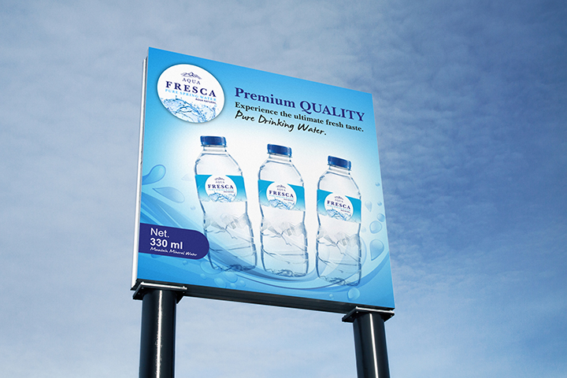

# Aqua Fresca - Pure Spring Water Website

A modern, responsive website for Aqua Fresca, a premium spring water company based in Timor-Leste. Built with Next.js 16, React, TypeScript, and Tailwind CSS.



## Features

- **Modern Design**: Clean, professional design with smooth animations and transitions
- **Fully Responsive**: Optimized for mobile, tablet, and desktop devices
- **SEO Optimized**: Comprehensive meta tags for social media sharing (Open Graph, Twitter Cards)
- **Performance**: Built with Next.js for optimal performance and SEO
- **Type-Safe**: Written in TypeScript for better code quality
- **Component-Based**: Modular React components for easy maintenance

## Tech Stack

- **Framework**: [Next.js 16](https://nextjs.org/) (App Router)
- **Language**: [TypeScript](https://www.typescriptlang.org/)
- **Styling**: [Tailwind CSS 3](https://tailwindcss.com/)
- **UI Library**: [React 19](https://react.dev/)
- **Image Optimization**: Next.js Image Component
- **Deployment**: [Vercel](https://vercel.com/) (recommended)

## Project Structure

```
aqua-fresca-nextjs/
├── public/
│   └── image/              # Product images and assets
├── src/
│   ├── app/
│   │   ├── layout.tsx      # Root layout with metadata
│   │   ├── page.tsx        # Home page
│   │   └── globals.css     # Global styles with Tailwind
│   └── components/
│       ├── Header.tsx      # Navigation header
│       ├── Hero.tsx        # Hero section
│       ├── About.tsx       # About section
│       ├── Products.tsx    # Products showcase
│       ├── Process.tsx     # Our process section
│       ├── Testimonials.tsx # Customer testimonials
│       ├── Contact.tsx     # Contact form
│       └── Footer.tsx      # Footer with links
├── tailwind.config.ts      # Tailwind configuration
├── postcss.config.mjs      # PostCSS configuration
└── package.json            # Dependencies
```

## Getting Started

### Prerequisites

- Node.js 18+ installed
- npm, yarn, or pnpm package manager

### Installation

1. Clone the repository:
```bash
git clone https://github.com/abraog/aqua_fresca.git
cd aqua_fresca/aqua-fresca-nextjs
```

2. Install dependencies:
```bash
npm install
# or
yarn install
# or
pnpm install
```

3. Run the development server:
```bash
npm run dev
# or
yarn dev
# or
pnpm dev
```

4. Open [http://localhost:3000](http://localhost:3000) in your browser to see the website.

## Available Scripts

- `npm run dev` - Starts the development server
- `npm run build` - Creates an optimized production build
- `npm start` - Starts the production server
- `npm run lint` - Runs ESLint for code quality

## Components Overview

### Header
- Fixed navigation with smooth scrolling
- Responsive mobile menu
- Logo and navigation links

### Hero Section
- Full-screen hero with background image
- Call-to-action button
- Animated scroll indicator

### About Section
- Company information
- Image with hover effects
- Grid layout for text and image

### Products Section
- Product cards with images
- Hover animations
- Responsive grid layout
- Three product sizes (500ml, 1.5L, 5L)

### Process Section
- 4-step process visualization
- Icon badges for each step
- Hover effects

### Testimonials Section
- Customer reviews with star ratings
- Profile images
- Card-based layout

### Contact Section
- Contact information with icons
- Contact form with validation
- Responsive two-column layout

### Footer
- Company information
- Quick links
- Product links
- Newsletter subscription
- Social media links

## Deployment

### Deploy to Vercel (Recommended)

1. Push your code to GitHub
2. Visit [Vercel](https://vercel.com)
3. Import your GitHub repository
4. Vercel will automatically detect Next.js and configure the build
5. Click "Deploy"

Your site will be live with automatic deployments on every push to the main branch.

### Manual Deployment

1. Build the project:
```bash
npm run build
```

2. Start the production server:
```bash
npm start
```

## Environment Variables

Currently, this project doesn't require environment variables. If you add API integrations (e.g., contact form backend), create a `.env.local` file:

```env
NEXT_PUBLIC_API_URL=your_api_url
```

## Customization

### Colors
Edit the Tailwind theme in `tailwind.config.ts` to change the primary color scheme.

### Images
Replace images in `public/image/` with your own product images.

### Content
Edit component files in `src/components/` to update text content.

### Metadata
Update SEO metadata in `src/app/layout.tsx`.

## Browser Support

- Chrome (latest)
- Firefox (latest)
- Safari (latest)
- Edge (latest)

## Contributing

1. Fork the repository
2. Create your feature branch (`git checkout -b feature/AmazingFeature`)
3. Commit your changes (`git commit -m 'Add some AmazingFeature'`)
4. Push to the branch (`git push origin feature/AmazingFeature`)
5. Open a Pull Request

## License

This project is licensed under the MIT License.

## Contact

**Aqua Fresca**
- Address: 123 Spring Road, Dili, Timor-Leste
- Phone: +670 7835 1999
- Email: marketing.austim@gmail.com

**Developer**
- Abrao Glorito
- GitHub: [@abraog](https://github.com/abraog)
- Repository: [aqua_fresca](https://github.com/abraog/aqua_fresca)

## Acknowledgments

- Built with [Next.js](https://nextjs.org/)
- Styled with [Tailwind CSS](https://tailwindcss.com/)
- Icons from Unicode Emoji
- Images optimized with Next.js Image

---

Made with ❤️ for Aqua Fresca
